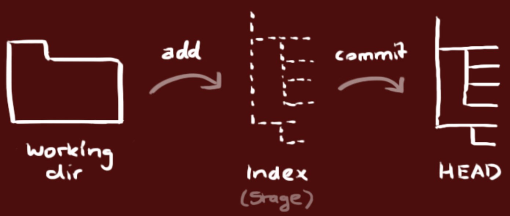

### 版本控制Git

#### 本地实施版本控制

可以使用下面的命令将目录创建为Git仓库。

```Shell
git init 
```

当你完成了上述操作后，本地目录就变成了下面的样子，左边是你正在操作的工作目录，而右边是你的本地仓库，中间是工作目录和本地仓库之间的一个暂存区（也称为缓存区）。



通过`git add`可以将文件添加到暂存区。

```Shell
git add <file> ...
```

可以用下面的方式将暂存区的指定文件恢复到工作区。

```Shell
git checkout -- <file>
```

通过下面的命令可以将暂存区的内容纳入本地仓库。

```Shell
git commit -m '本次提交的说明'
```

可以使用下面的命令查看文件状态和进行版本比较。

```Shell
git status -s
git diff
```

可以通过`git log`查看提交日志。

```Shell
git log
git log --graph --pretty=oneline --abbrev-commit
```

如果要回到历史版本，可以使用下面的命令。

```Shell
git reset --hard <commit-id>
git reset --hard HEAD^
```

其他的一些命令可以参考阮一峰老师的[《常用Git命令清单》](http://www.ruanyifeng.com/blog/2015/12/git-cheat-sheet.html)或者是码云上的[《Git大全》](https://gitee.com/all-about-git)。

#### Git服务器

登录Git服务器后就可以创建项目，创建项目几乎是“傻瓜式”的，我们只说几个值得注意的地方。

1. 添加项目成员。创建项目后，可以在项目的“设置”或“管理”中找到“成员管理”功能，这样就可以将其他开发者设置为项目团队的成员，项目成员通常分为“所有者”、“管理者”、“普通成员”和“受限成员”几种角色。

2. 设置公钥实现免密操作。在项目的“设置”或“管理”中我们还可以找到“部署公钥管理”的选项，通过添加部署公钥，可以通过SSH（安全远程连接）的形式访问服务器而不用每次输入用户名和口令。可以使用`ssh-keygen`命令来创建密钥对。

   ```Shell
   ssh-keygen -t rsa -C "your_email@example.com"
   ```

#### 使用Git进行开发

克隆服务器上的代码到本地机器。

```Shell
git clone <url>
```

在自己的分支上进行开发。

```Shell
git branch <branch-name>
git checkout <branch-name>
```

或者

```Shell
git checkout -b <branch-name>
```

接下来可以先在本地实施版本控制（操作的方式与前面相同不再赘述），然后再将自己的分支Push到服务器。

```Shell
git push origin <branch-name>
```

最后，当工作完成时，可以发起一个Pull Request，请求将代码合并到master分支。

#### 分支策略的模式

上面讲解的方式，其实是一种称为github-flow的分支策略模式，这种模式的操作步骤包括：

1. master的内容都是可以进行发布的内容。
2. 开发时应该以master为基础建立新分支。
3. 分支先在本地实施版本控制，然后以同名分支定期向服务器进行Push。
4. 开发结束后向master发送Pull Request。
5. Pull Request通过代码审查之后合并到master，并从master向正式环境发布。

在使用github-flow时的注意事项有以下三点：

1. master是用于发布的，不能直接在master上进行修改。
2. 开始日常开发工作时要首先建立分支。
3. 工作完成后向master发送Pull Request。

除了上述的github-flow工作方式外，还有一种名为git-flow的分支策略模式，它借鉴了中央集权型版本控制系统的长处，为团队内部统一管理建立分支的方法、合并操作和关闭分支的方法。在这种模式下，项目有两个长线分支，分别是master和develop，其他的都是临时的、短暂的辅助分支，包括feature（开发特定功能的分支，开发结束后合并到develop）、release（从develop分离出来的为发布做准备的分支，发布结束后合并到master和develop）和hotfix（产品发布后出现问题时紧急建立的分支，直接从master分离，问题修复后合并到master并打上标签，同时还要合并到develop来避免将来的版本遗漏了这个修复工作，如果此时有正在发布中的release分支，还要合并到release分支）。这套方式分支策略简单清晰且容易理解，但是在运用上会稍微有些复杂，需要一些脚本来辅助版本控制的实施。

### 缺陷管理

没有好的团队管理工具必然导致项目进展不顺利，任务管理困难，而引入缺陷管理系统正好可以解决这些问题，通常一个缺陷管理系统都包含了以下的功能：

1. 任务管理（包括必须做什么、谁来做、什么时候完成、现在处于什么状态等）。
2. 直观而且可以检索过去发生的各种问题。
3. 能够对信息进行统一的管理和共享。
4. 能够生成各类报表。
5. 能够关联到其他系统，具有可扩展性。

### 持续集成

为了快速的产生高品质的软件，在团队开发中，持续集成（CI）也是一个非常重要的基础。按照经典的软件过程模型（瀑布模型），集成的工作一般要等到所有的开发工作都结束后才能开始，但这个时候如果发现了问题，修复问题的代价是非常具体的。基本上，集成实施得越晚，代码量越大，解决问题就越困难。持续集成将版本控制、自动化构建、代码测试融入到一起，让这些工作变得自动化和可协作。由于其频繁重复整个开发流程（在指定时间内多次pull源代码并运行测试代码），所以能帮助开发者提早发现问题。